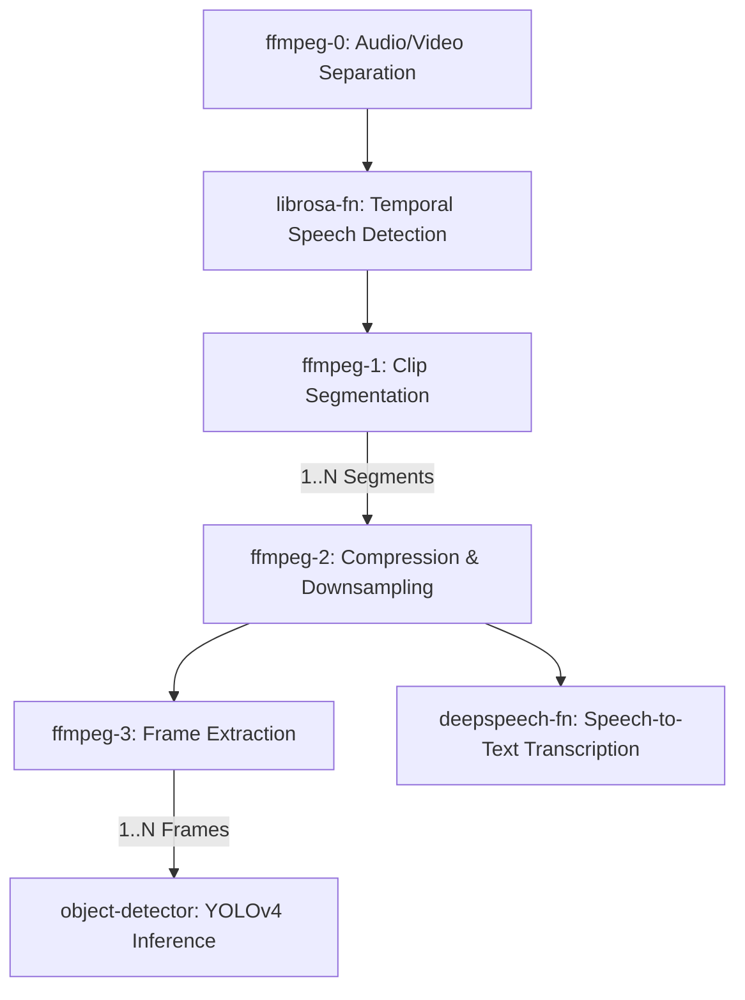

# VideoSearcher: Serverless Orchestration of Video Processing Workloads on OpenFaaS

This repository contains the implementation of **VideoSearcher**, an academic project focused on migrating an established artificial intelligence video processing pipeline (originally designed within the AI-SPRINT framework) into a highly scalable, serverless architecture using **OpenFaaS**. The system is capable of executing on both local Kubernetes environments (Docker Desktop) and cloud infrastructures (AWS EKS).

A primary constraint and design goal of this project was to achieve this serverless migration **without modifying the original source code** (`main.py`) of the underlying analytical stages. This was realized through the development of transparent data wrappers and custom queue orchestration mechanisms.

---

## Table of Contents
- [Project Overview](#project-overview)
- [System Architecture & Methodology](#system-architecture--methodology)
- [Implementation Details](#implementation-details)
- [Deployment & Replication Instructions](#deployment--replication-instructions)
- [Technical Challenges & Mitigations](#technical-challenges--mitigations)
- [Performance Evaluation](#performance-evaluation)
- [Future Work](#future-work)

---

## Project Overview

The core objective is the orchestration of the AI-SPRINT VideoSearcher application, a multi-stage pipeline designed to parse, process, and analyze video content. The pipeline consists of seven distinct execution stages:

1. **`ffmpeg-0`**: Audio and video distinct track splitting.
2. **`librosa-fn`**: Speech segment detection utilizing the Librosa library.
3. **`ffmpeg-1`**: Video clip segmentation based on temporal speech data.
4. **`ffmpeg-2`**: Audio downsampling (16kHz mono) and video compression.
5. **`ffmpeg-3`**: Continuous frame extraction from segmented clips (12 fps).
6. **`deepspeech-fn`**: Speech-to-text transcription leveraging the Mozilla DeepSpeech model.
7. **`object-detector`**: Object detection within extracted frames using a YOLOv4 ONNX model.

In its original iteration, each stage operated as a monolithic Command Line Interface (CLI) application. This project encapsulates each stage within a dedicated OpenFaaS container to convert the sequential structure into a distributed, event-driven serverless ecosystem.

---

## System Architecture & Methodology

The pipeline execution exhibits fan-in and fan-out architectural patterns. While some nodes operate sequentially, stages such as `ffmpeg-1` partition the input into multiple outputs, and `ffmpeg-3` generates numerous frames per segment. 



### The Classic Watchdog Pattern
To satisfy the constraint of leaving the original Python scripts unmodified, the OpenFaaS **Classic Watchdog** (`fwatchdog`) was employed. The watchdog initializes an HTTP server on port 8080 and streams JSON payloads via `STDIN` into a custom shell wrapper (`entry.sh`). This wrapper parses the execution context and translates it into standard CLI arguments (`-i` for input, `-o` for output).

---

## Implementation Details

Transitioning a monolithic data pipeline into a distributed serverless landscape required several novel architectural components:

### 1. Transparent Cloud Storage Wrapper (`s3_helper.py`)
Because OpenFaaS functions execute in isolated Kubernetes Pods without a shared global file system, data continuity between stages was achieved via Amazon S3. The `s3_helper.py` script intercepts CLI file path arguments; if an `s3://` URI is detected, the script pre-fetches the object to a localized staging directory prior to function execution and seamlessly synchronizes the output directory back to S3 upon termination.

### 2. SQS Queue Orchestration 
To maintain asynchronous, event-driven execution without relying on heavy orchestrators or AWS Lambda, an SQS-based publishing protocol was integrated. Upon processing completion, the local wrapper publishes the subsequent S3 contextual URI to a designated AWS SQS queue. Custom **SQS Bridge** consumers operate within the Kubernetes cluster, polling these queues and forwarding HTTP POST requests to the successive OpenFaaS functions.

### 3. Dependency Mocking (`aisprint-stub`)
The original application imported proprietary functions (e.g., `@annotation` and `load_and_inference`) from the closed-source `aisprint` library. To enable successful execution without altering the source, an `aisprint-stub` package was created and injected during the Docker build process. This package mimics the required library by returning functional no-op decorators and handling baseline ONNX inferencing logic.

---

## Deployment & Replication Instructions

### 1. Infrastructure Provisioning
The application is validated on localized Kubernetes (Docker Desktop) and Amazon Elastic Kubernetes Service (EKS). For cloud deployment, a cluster with sufficient resources for machine learning model inference is recommended. For this research, an EKS cluster consisting of `m7i-flex.large` nodes was utilized.

```bash
# EKS Cluster Provisioning
eksctl create cluster \
  --name videosearcher \
  --region us-east-1 \
  --node-type m7i-flex.large \
  --nodes 2 \
  --managed
```

Following cluster initialization, deploy the OpenFaaS Community Edition using standard Helm charts.

### 2. Image Compilation
*Note: Ensure container images are compiled for the `linux/amd64` architecture, as required by the DeepSpeech binary dependencies and AWS EKS nodes.*

A centralized `build.sh` script is provided to compile the seven requisite container images. Ensure Docker Hub credentials are authenticated prior to execution, as OpenFaaS CE requires images to be pulled from a public registry.

```bash
./build.sh
docker push <username>/ffmpeg-0:latest
# Repeat for all functions
faas-cli deploy -f stack.yml
```

### 3. Orchestration Configuration
Provision the corresponding AWS SQS queues. Embed the generated Queue URLs into the `NEXT_QUEUES_JSON` environment variables defined in the OpenFaaS `stack.yml` deployment manifest. Finally, deploy the `sqs-bridge` images to enable asynchronous polling.

---

## Technical Challenges & Mitigations

The development of this distributed architecture exposed several complex synchronization and data-integrity challenges:

1. **Shared Filesystem Race Conditions:**
   Under concurrent load scenarios, multiple processes executing within the same pod utilized a shared `/tmp/s3data` staging directory. Completion of one process resulted in directory deletion, inadvertently purging active data from parallel executions. This was mitigated by appending the unique shell process ID (PID) to the localized storage path (`/tmp/s3data_$$`).
   
2. **Fan-Out Data Integrity (S3 Overwrites):**
   Fan-out stages generated multiple discrete output streams. Due to static naming conventions within the initial S3 orchestrator, parallel instances of downstream nodes (e.g., `ffmpeg-2`) repeatedly overwrote mutual results in the S3 bucket. The underlying `queue_helper.py` was refactored to dynamically embed the unique input chunk identifier into the output prefix, ensuring absolute state isolation.

3. **Cascading Payload Errors:**
   Subsequent to fixing data isolation, downstream pods (such as `object-detector`) experienced execution starvation. Incorrect directory root formulations in the upstream SQS publisher generated empty compressed archives, terminating the pipeline silently. Restructuring the prefixation logic invoked by the nested Shell instances resolved this fault sequence.

4. **Resource Constraints:**
   Deploying seven memory-intensive containers resulted in immediate cluster exhaustion (`Pending` pods). Default requests were aggressively tuned down to `128Mi` while maintaining generous execution limits (`1Gi`) to account for dynamic memory expansion during model loading.

---

## Performance Evaluation

To assess the robustness and scalability of the serverless architecture, load testing was conducted utilizing **Apache JMeter** and **Locust**. The experimental setup involved localized orchestration testing evaluating:

- Progressive concurrency thresholds (5, 10, and 15 simulated users).
- Randomized S3 UUID tracking to validate distributed data integrity.
- Simulated human wait times between functional transactions.

Detailed metric logs, encompassing network latency, function execution duration, and queue processing latency, are aggregated in the `results/` directory of the corresponding test suites.

---

## Future Work

To further optimize the architecture, multiple avenues for future research exist:
- **Autoscaling:** Implementation of a scale-to-zero mechanism utilizing the Kubernetes Cluster Autoscaler to minimize idle structural consumption.
- **Model Efficiency:** Migration from the Mozilla DeepSpeech module to more heavily optimized alternatives (e.g., Whisper) offering native ARM64 support.
- **Decoupled Model Storage:** Redesigning the Docker images to exclude large model weights, favoring dynamic loading from S3 instances during cold starts to optimize container footprint.
